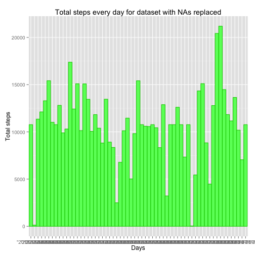
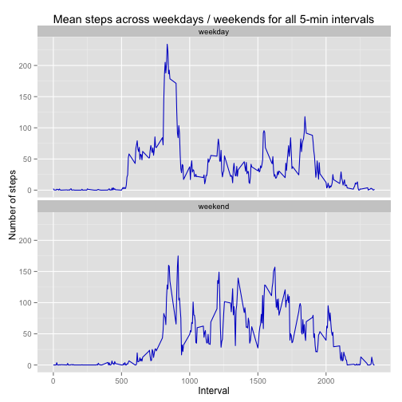

# Reproducible Research: Peer Assessment 1


## Loading and preprocessing the data

```r
source("load_data.R")

dataset <- load_data()
```

```
## Loading required package: gsubfn
## Loading required package: proto
## Loading required package: RSQLite
## Loading required package: DBI
## Loading required package: RSQLite.extfuns
```

```
## Warning: closing unused connection 5 (./activity.csv)
## Warning: NAs introduced by coercion
```


## What is mean total number of steps taken per day?

```r
source("mean_total_steps_every_day.R")

total_steps_per_day <- get_total_steps_per_day(dataset)

## draw the histogram
library(ggplot2)
ggplot(total_steps_per_day, aes(x = days, y = total_steps)) + geom_bar(stat = "identity", 
    width = 1, aes(fill = "red"), colour = "#CC0000") + xlab("Days") + ylab("Total steps") + 
    ggtitle("Total steps every day")
```

 

```r

mean_total_steps <- mean(total_steps_per_day$total_steps)
median_total_steps <- median(total_steps_per_day$total_steps)
```

**Mean total number of steps taken per day is:** 

```r
mean_total_steps
```

```
## [1] 9354
```

**Median total number of steps taken per day is:** 

```r
median_total_steps
```

```
## [1] 10395
```


## What is the average daily activity pattern?

```r
source("time_series.R")

mean_steps_per_interval <- get_mean_steps_per_interval(dataset)

# Create the time series plot
library(ggplot2)
ggplot(mean_steps_per_interval, aes(x = intervals, y = mean_steps)) + geom_line(colour = "#0000CC") + 
    xlab("Intervals") + ylab("Mean steps") + ggtitle("Mean steps across all days for all 5-min intervals")
```

 

```r

max_interval <- find_max_interval(mean_steps_per_interval)
```

**Interval with the max mean steps is:** 

```r
max_interval[1, "intervals"]
```

```
## [1] 835
```


**It has recorded the following mean steps :** 

```r
max_interval[1, "max_mean"]
```

```
## [1] 206.2
```


## Imputing missing values

```r
source("imputing_missing_values.R")

missing_values <- find_count_missing_values(dataset)
```

**Number of missing values :** 

```r
missing_values[1, "missing"]
```

```
## [1] 0
```


Now replacing NAs with the mean steps in all the 5-min intervals

```r

replaced_with_5min_mean_dataset <- replace_missing_values(dataset, mean_steps_per_interval)
```


Now creating the histogram for the new dataset with the values replaced

```r
new_total_steps_per_day <- get_total_steps_per_day(replaced_with_5min_mean_dataset)

## draw the histogram
library(ggplot2)
ggplot(new_total_steps_per_day, aes(x = days, y = total_steps)) + geom_bar(stat = "identity", 
    width = 1, aes(fill = "green"), fill = "#66FF66", colour = "#00CC00") + 
    xlab("Days") + ylab("Total steps") + ggtitle("Total steps every day for dataset with NAs replaced")
```

 

```r

new_mean_total_steps <- mean(new_total_steps_per_day$total_steps)
new_median_total_steps <- median(new_total_steps_per_day$total_steps)
```

**Mean total number of steps taken per day for dataset with NAs replaced is:** 

```r
new_mean_total_steps
```

```
## [1] 10766
```

**Median total number of steps taken per day for dataset with NAs replaced is:** 

```r
new_median_total_steps
```

```
## [1] 10766
```


Do these values differ from the estimates from the first part of the assignment? 

**Yes they differ from the first part.**

What is the impact of imputing missing data on the estimates of the total daily number of steps?

**The mean and median have increased after the imputting. Also the mean and median have now converged to be the same value.**

## Are there differences in activity patterns between weekdays and weekends?

```r
source("weekday_weekend.R")
# determine day of the week for each record
dataset_with_days <- add_weekday_weekend(dataset)
# have two subsets: 1 for weekdays 1 for weekends
weekday_subset <- get_weekday_records(dataset_with_days)
weekend_subset <- get_weekend_records(dataset_with_days)
# apply the get_mean_steps_per_interval for each subset
mean_steps_per_interval_weekday <- get_mean_steps_per_interval(weekday_subset)
mean_steps_per_interval_weekend <- get_mean_steps_per_interval(weekend_subset)
# add the column weekday and assign the value 'weekday' for the weekday
# subset after getting the mean_steps_per_interval
mean_steps_per_interval_weekday$weekday <- c("weekday")
# add the column weekday and assign the value 'weekend' for the weekend
# subset after getting the mean_steps_per_interval
mean_steps_per_interval_weekend$weekday <- c("weekend")

# merge the two subsets vertically
mean_steps_per_interval_by_weekday <- rbind(mean_steps_per_interval_weekend, 
    mean_steps_per_interval_weekday)

# Create the time series plot
library(ggplot2)
ggplot(mean_steps_per_interval_by_weekday, aes(x = intervals, y = mean_steps, 
    group = weekday)) + geom_line(colour = "#0000CC") + xlab("Interval") + ylab("Number of steps") + 
    facet_wrap(~weekday, nrow = 2) + ggtitle("Mean steps across weekdays / weekends for all 5-min intervals")
```

 

