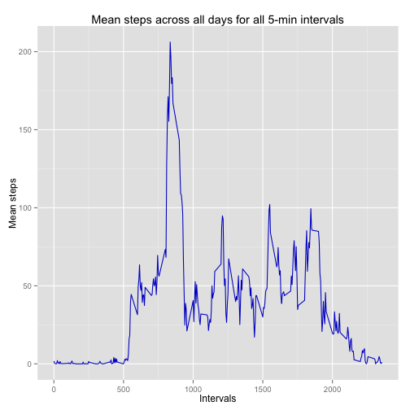

# Reproducible Research: Peer Assessment 1


## Loading and preprocessing the data

```r
source("load_data.R")

dataset <- load_data()
```

```
## Loading required package: gsubfn
## Loading required package: proto
## Loading required package: RSQLite
## Loading required package: DBI
## Loading required package: RSQLite.extfuns
```

```
## Warning: closing unused connection 5 (./activity.csv)
```


## What is mean total number of steps taken per day?

```r
source("mean_total_steps_every_day.R")

total_steps_per_day <- get_total_steps_per_day(dataset)
```

```
## Warning: NAs introduced by coercion
```

```r

## draw the histogram
library(ggplot2)
ggplot(total_steps_per_day, aes(x = days, y = total_steps)) + geom_bar(stat = "identity", 
    width = 1, aes(fill = "red"), colour = "#CC0000") + xlab("Days") + ylab("Total steps") + 
    ggtitle("Total steps every day")
```

 

```r

mean_total_steps <- mean(total_steps_per_day$total_steps)
median_total_steps <- median(total_steps_per_day$total_steps)
```

**Mean total number of steps taken per day is:** 

```r
mean_total_steps
```

```
## [1] 9354
```

**Median total number of steps taken per day is:** 

```r
median_total_steps
```

```
## [1] 10395
```


## What is the average daily activity pattern?

```r
source("time_series.R")

mean_steps_per_interval <- get_mean_steps_per_interval(dataset)
```

```
## Warning: NAs introduced by coercion
```

```r

# Create the time series plot
library(ggplot2)
ggplot(mean_steps_per_interval, aes(x = intervals, y = mean_steps)) + geom_line(colour = "#0000CC") + 
    xlab("Intervals") + ylab("Mean steps") + ggtitle("Mean steps across all days for all 5-min intervals")
```

 

```r

max_interval <- find_max_interval(mean_steps_per_interval)
```

**Interval with the max mean steps is:** 

```r
max_interval[1, "intervals"]
```

```
## [1] 835
```


**It has recorded the following mean steps :** 

```r
max_interval[1, "max_mean"]
```

```
## [1] 206.2
```


## Imputing missing values


## Are there differences in activity patterns between weekdays and weekends?
